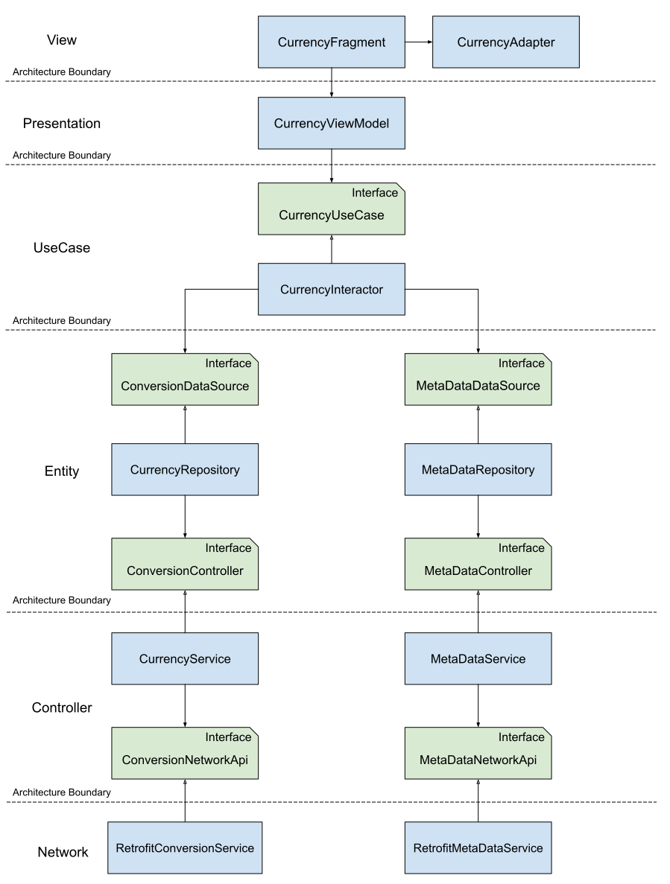
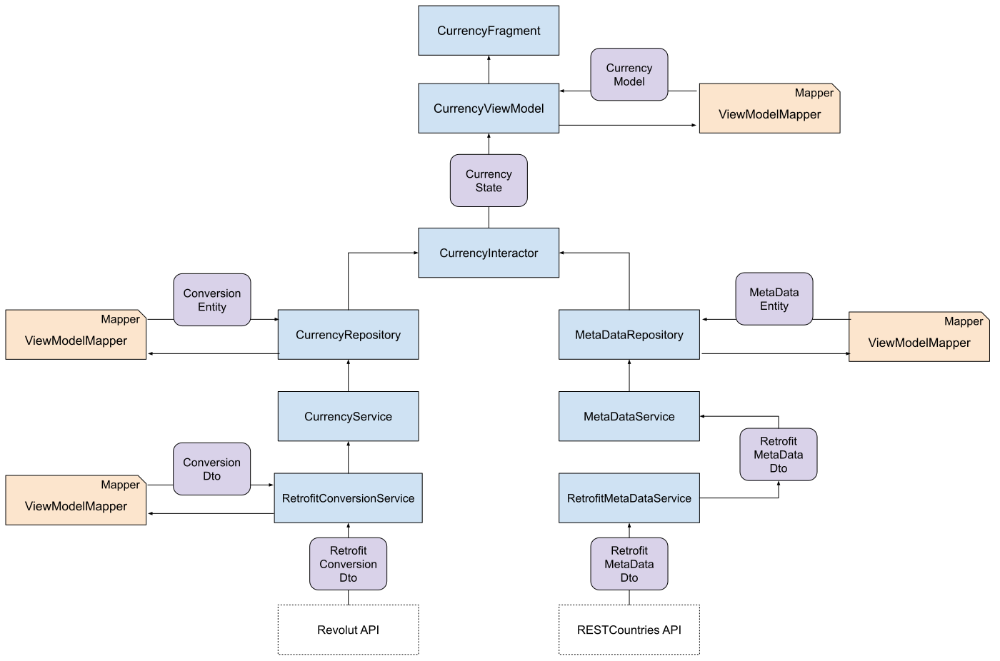

# Currency Converter

## Description

Small project that uses the specified API to obtain the currency conversion rates for a specific currency to a variety of other currencies. The required UI dictates that these conversion rates are applied to an input value and displayed in a list as numerical values along with the associated currency codes, currency names and national flags.
 
The application therefore hits the Revolut API to obtain the conversion rates for the Euro. Due to the fact that this API only provides the currency codes and conversion rates for the other currencies, the application then uses the RESTCountries API to obtain a list of countries where each currency is recognised. This list is evaluated to identify the country with the largest population and the flag asset for this country is then loaded into list along with the currencies name.

When another currency is selected, the Revolut API is then used to obtain the conversion rates for that currency.

## Known Issues

* Currently the Euro is displayed with a German flag, this is because Germany is the country with the largest population that uses the Euro currency.

## Architecture

The application uses a MVVM architecture and tries to focus on clean architecture principles to ensure that the dependencies within the application are correctly orientated and that code based remains changeable. The diagram below illustrates the main classes within the application and their primary dependencies. 

## Model Flow

Each application layer passes the most appropriate data entities across each architecture boundary. While this results in a large number of similar data classes, it aids decoupling each layer from one another. Mappers are used to perform the transformations from one data entity to another. The diagram below describes the data model flows within the application.

## Assumption

* Specification states that the app should refresh every second. The implementation does not simply send a request every second but rather waits until a (un)successful response, delays a second and then repeats. This avoids sending multiple requests when it may not be necessary i.e. when there is no data connection.

## Limitations

The following items describes limitations of the application that could be improved if development was continued.

* The application performs no data connection checking

* The application performs no specific threading but rather relies on the behaviour of LiveData and Retrofit libraries.

* The application performs no persistance

* The application does not include a bespoke app icon

* The application obtains the meta data for each currency uses a queue, the introduction of a factory class would allow for this to be done concurrently.
